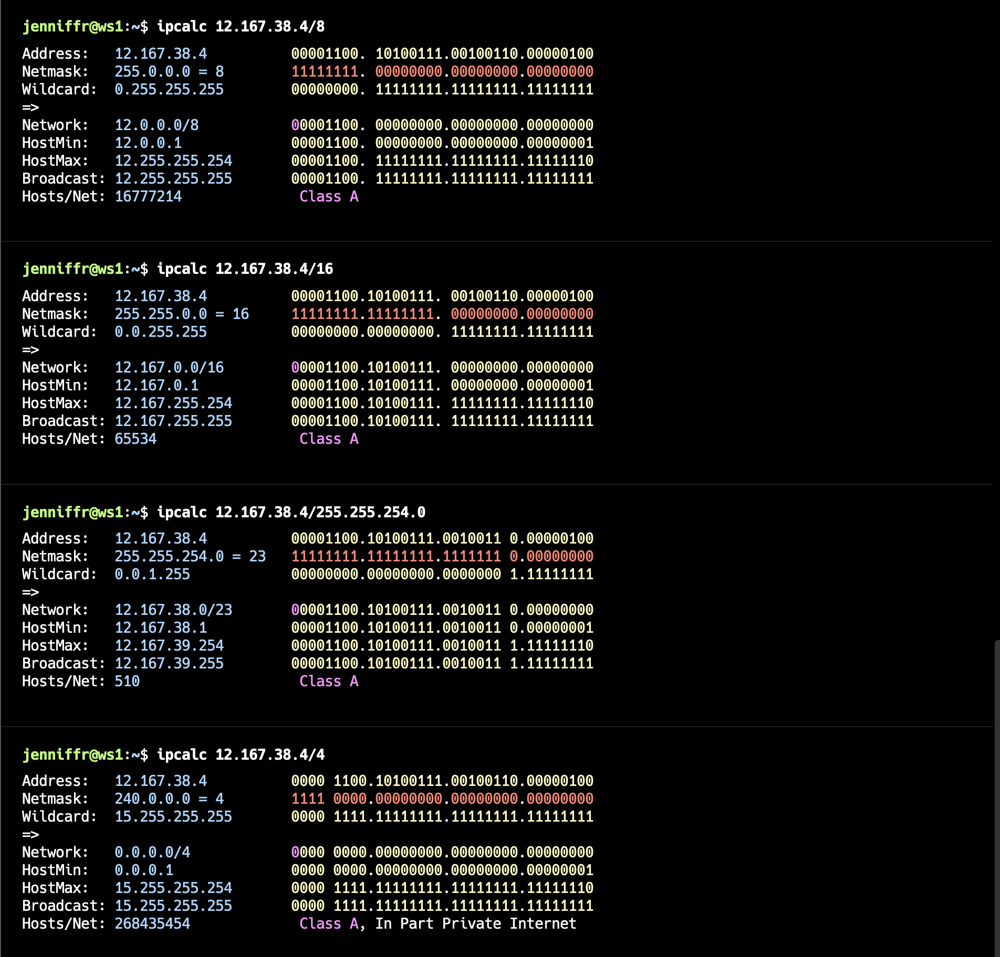

# Сети в Linux

Настройка сетей в Linux на виртуальных машинах.

[Eng readme](./readme.md)

## Part 1. Инструмент **ipcalc**
#### 1.1. Сети и маски
##### 1) Адрес сети *192.167.38.54/13* через **ipcalc**.


##### 2) Подробности масок *255.255.255.0* , */15* , *11111111.11111111.11111111.11110000*


##### 3) Минимальный и максимальный хост в сети *12.167.38.4* при масках: */8*, *11111111.11111111.00000000.00000000*, *255.255.254.0* и */4*


#### 1.2. localhost
##### К приложению работающему на localhost, можно обратиться  со следующих IP: 

```
*127.0.0.2*, *127.1.0.1*
```


#### 1.3. Диапазоны и сегменты сетей
Приватные диапазоны:
- **10.0.0.0 - 10.255.255.255** (10.0.0.0/8)
- **172.16.0.0 - 172.31.255.255** (172.16.0.0/12)
- **192.168.0.0 - 192.168.255.255** (192.168.0.0/16)

##### 1) **Публичные:**
- 134.43.0.2
- 172.0.2.1
- 192.172.0.1
- 172.68.0.2
- 192.169.168.1

##### 2) **Частные:**
- 10.0.0.45
- 192.168.4.2
- 172.20.250.4
- 172.16.255.255
- 10.10.10.10

## Part 2. Статическая маршрутизация между двумя машинами
##### С помощью команды `ip a` смотрим существующие сетевые интерфейсы.


##### Опиши сетевые интерфейсы для каждой машины в конфигурационных файлах.


##### Применим изменения с помощью команды `netplan apply` и проверим внесенные изменения через `ip a`


#### 2.1. Добавление статического маршрута вручную
##### Добавляем статический маршрут от одной машины до другой и обратно при помощи команды вида `ip route add` и пингуем соединение


#### 2.2. Добавление статического маршрута с сохранением
##### Перезапускаем машины. Маршруты сбросились
##### Добавляем статический маршрут от одной машины до другой с помощью файла *etc/netplan/00-installer-config.yaml*.


##### Пингуем для проверки соединения 


## Part 3. Утилита **iperf3**

#### 3.1. Перевод скоростей соединения

1. **8 Mbps в MB/s:**
    
    - 1 Mbps = 0.125 MB/s
    - 8 Mbps = 8 * 0.125 = 1 MB/s
    
    **Ответ:** 8 Mbps = 1 MB/s
    
2. **100 MB/s в Kbps:**
    
    - 1 MB/s = 8000 Kbps
    - 100 MB/s = 100 * 8000 = 800000 Kbps
    
    **Ответ:** 100 MB/s = 800000 Kbps
    
3. **1 Gbps в Mbps:**
    
    - 1 Gbps = 1000 Mbps
    
    **Ответ:** 1 Gbps = 1000 Mbps

#### 3.2. Утилита **iperf3**
##### Измеряем скорость соединения между ws1 и ws2.


## Part 4. Сетевой экран

#### 4.1. Утилита **iptables**
##### Создаем и описываем */etc/firewall.sh* для каждой машины.


##### Даем права и запускаем файлы


##### Разница между стратегиями

###### Стратегия на ws1:
В начале скрипта установлены запрещающие правила по умолчанию (DROP).
Конкретные разрешающие правила добавлены после запрещающих.
Подход более строгий, сначала запрещаем весь трафик, потом разрешаем только нужный.

###### Стратегия на ws2:
В начале скрипта установлены разрешающие правила по умолчанию (ACCEPT).
Конкретные запрещающие правила добавлены после разрешающих.
Подход более либеральный, сначала разрешаем весь трафик, потом запрещаем только ненужный.

#### 4.2. Утилита **nmap**
##### Командой **ping** находим машину, которая не «пингуется», после чего утилитой **nmap** проверяем, что хост машины запущен.


## Part 5. Статическая маршрутизация сети
Сеть: \


##### Поднимаем пять виртуальных машин (3 рабочие станции (ws11, ws21, ws22) и 2 роутера (r1, r2)).

#### 5.1. Настройка адресов машин
##### Настраиваем конфигурации машин в *etc/netplan/00-installer-config.yaml* согласно сети на рисунке 
- `r1` и `r2` соответственно:
 
- `ws11`:

- `ws21` и `ws22` соответственно:


##### Применяем настройки файлов и проверяем корректность с помощью `ip -4 a` 

- `r1` и `r2` соответственно:

- `ws11`:

- `ws21` и `ws22` соответственно:


##### Пингуем 

- `ws22` с `ws21`

- `r1` с `ws11`


#### 5.2. Включение переадресации IP-адресов
##### Для включения переадресации IP, выполняем команду `sysctl -w net.ipv4.ip_forward=1` на роутерах:

*При таком подходе переадресация не будет работать после перезагрузки системы.*


##### Открываем файл */etc/sysctl.conf* и добавляем в него следующую строку: `net.ipv4.ip_forward = 1`

*При использовании этого подхода, IP-переадресация включена на постоянной основе.*

#### 5.3. Установка маршрута по-умолчанию

##### Настраиваем маршруты для машин.
- `ws11`:
 
 - `ws21`:
 
 - `ws22`:
 
##### Проверяем корректность маршрутов 
- `ws11`:

- `ws21`:
- 
- `ws22`:


##### Пингуем с ws11 роутер r2
С помощью `tcpdump -tn -i eth0` смотрим что пинг доходит до роутера.


#### 5.4. Добавление статических маршрутов
##### Добавляем в роутеры r1 и r2 статические маршруты в файле конфигураций. 

##### Используем `ip r`для просмотра маршрутов

##### Запускаем команды на ws11:
`ip r list 10.10.0.0/[маска сети]` и `ip r list 0.0.0.0/0`

Настройка более специфичных маршрутов всегда имеет приоритет над менее специфичными, что обеспечивает оптимальное распределение трафика и минимизацию задержек, поэтому был выбран именно специфичный маршрут.

#### 5.5. Построение списка маршрутизаторов
##### Запускаем на r1 команду дампа и при помощи утилиты **traceroute** строим список маршрутизаторов на пути от ws11 до ws21.


Программа **traceroute** выполняет отправку данных указанному узлу сети, при этом отображая сведения о всех промежуточных маршрутизаторах, через которые прошли данные на пути к целевому узлу. Отправляет пакет с TTL=1, увеличивая время жизни пакета при прохождении узла, чтобы понять какой узел не проходит.

#### 5.6. Использование протокола **ICMP** при маршрутизации
##### Запускаем на r1 перехват сетевого трафика и пингуем с ws11 несуществующий IP


## Part 6. Динамическая настройка IP с помощью **DHCP**

##### Для r2 настраиваем в файле */etc/dhcp/dhcpd.conf* конфигурацию службы **DHCP**:
##### 1) Указываем адрес маршрутизатора по-умолчанию, DNS-сервер и адрес внутренней сети для r2.

##### 2) В файле *resolv.conf*  прописываем `nameserver 8.8.8.8`.

##### Перезагружаем службу **DHCP** командой `systemctl restart isc-dhcp-server`.

 ##### Перезагружаем машины ws21 и ws22 и смотрим их ip. 

##### Пингуем ws22 с ws21.


##### Указываем  MAC адрес у ws11:

##### Настраиваем *r1* аналогично  *r2*:


Получаем ip от DCHP роутера:

Пингуем **ws11** с **ws22**

##### Сбросил и запросил с ws21 обновление ip адреса.


В данном пункте были использованы следующие опции DHCP сервера:

1. **range**: Эта опция используется для указания диапазона IP-адресов, которые DHCP сервер может назначать клиентам в сети. В конфигурационном файле для r2 диапазон был указан как `range 10.20.0.2 10.20.0.50;`.
    
2. **option routers**: Эта опция задает адрес маршрутизатора (шлюза) по умолчанию для клиентов, получающих IP-адреса от DHCP сервера. В нашем случае для r2 это был `option routers 10.20.0.1;`.
    
3. **option domain-name-servers**: Эта опция указывает адрес DNS-сервера, который будет использован клиентами для разрешения доменных имен. Для r2 это был `option domain-name-servers 10.20.0.1;`.
    
4. **subnet** и **netmask**: Эти опции используются для определения сети и маски подсети, в которой будет действовать DHCP сервер. В конфигурационном файле для r2 было определено две подсети:
    
    - `subnet 10.100.0.0 netmask 255.255.0.0 {}`
    - `subnet 10.20.0.0 netmask 255.255.255.192 { ... }`

## Part 7. **NAT**
##### В файле */etc/apache2/ports.conf* на ws22 и r1 меняем строку `Listen 80` на `Listen 0.0.0.0:80`:
 ws22:

r1:

##### Запускаем веб-сервер Apache командой `service apache2 start` на ws22 и r1.


##### Создаем и запускаем на r2 firewall:


##### Проверяем соединение между ws22 и r1 командой `ping`.


#####  Разрешаем маршрутизацию всех пакетов протокола **ICMP**.


##### Добавляем в файл ещё два правила - **SNAT** и **DNAT**:

##### Проверяем соединения:


## Part 8. Дополнительно. Знакомство с **SSH Tunnels**
##### Запускаем на r2 фаервол с правилами из Части 7.

##### Запускаем Apache2 с таким конфигом на ws22:

#####  Подключаем ws22 к ws21 по ssh:


#####  Подключаем  ws22 к ws11 по ssh:


